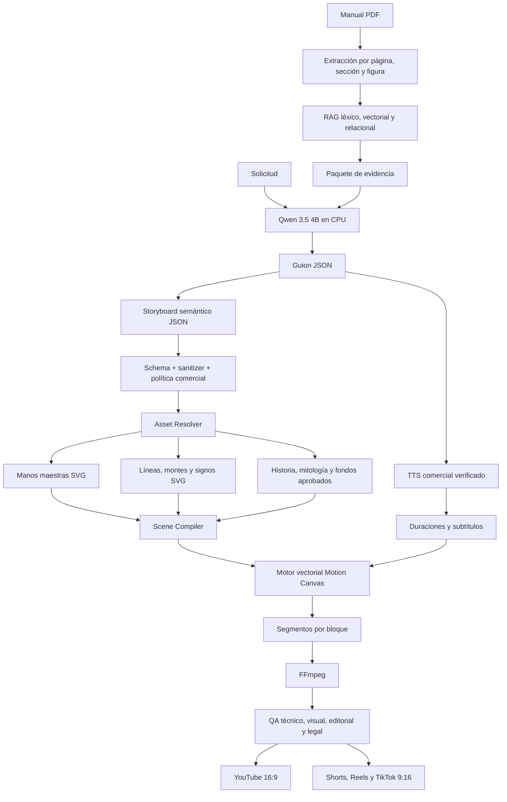

# ESPECIFICACIÓN MAESTRA EJECUTABLE - VIDEO FACTORY LOCAL V8

**Proyecto:** Fábrica local y monetizable de videos educativos de quiromancia  
**Idioma editorial:** Español de México (`es-MX`)  
**Versión de la especificación:** 1.0  
**Estado:** Lista para implementación controlada  
**Objetivo:** Migrar el sistema funcional V5/V6/V7 hacia una arquitectura V8 reproducible, segura, trazable, monetizable, optimizada para una NVIDIA GTX 1050 de 4 GB y capaz de producir videos horizontales de 8 a 10 minutos y piezas verticales derivadas.

---

## 0. INSTRUCCIÓN DE EJECUCIÓN PARA LA IA AGENTE

Actúa como arquitecto senior de software, MLOps, gráficos vectoriales, automatización multimedia, seguridad y QA.

Debes implementar esta especificación sin reinterpretar silenciosamente sus requisitos. No prometas resultados perfectos sin evidencia. La calidad queda garantizada mediante **gates verificables**, pruebas automatizadas, revisión visual y fallos cerrados. Si un gate falla, detente, registra la causa y no avances a producción.

### Reglas absolutas

1. No destruyas ni sobrescribas el pipeline funcional V5/V6/V7.
2. Trabaja en una rama separada llamada `v8-vector-engine`.
3. Crea respaldo y etiqueta Git antes de modificar archivos.
4. No expongas Ollama, dashboard, ComfyUI, base de datos ni APIs a Internet.
5. No guardes secretos, credenciales, tokens ni cadenas de conexión en código, Markdown, manifests o logs.
6. No utilices modelos, voces o assets no comerciales en contenido monetizado.
7. No uses generación de imagen para dibujar líneas, montes, signos, etiquetas o texto.
8. No generes una mano nueva para cada escena.
9. No aceptes una mano con dedos faltantes, duplicados, fusionados, recortados o anatómicamente ambiguos.
10. No permitas que Qwen entregue rutas, comandos, URLs o nombres arbitrarios de archivos. Qwen solo selecciona IDs registrados.
11. No presentes la quiromancia como diagnóstico médico, hecho científico, pronóstico clínico o destino inevitable.
12. No interpretes una Línea de la Vida corta como una vida corta.
13. No avances si una licencia comercial no está verificada.
14. No publiques automáticamente. La aprobación humana es obligatoria.
15. Todo texto visible debe renderizarse con el compositor, nunca dentro de una imagen generada.
16. Toda ortografía visible debe pasar validación `es-MX`.
17. Mantén compatibilidad con el perfil de audio estable AAC, 44.1 kHz, estéreo, 192 kbps hasta aprobar formalmente uno de 48 kHz.
18. Registra versión, hash, licencia, origen y QA de cada software, modelo, voz y asset.

---

# 1. RESULTADO FINAL ESPERADO

El usuario debe poder ejecutar:

```powershell
python scripts/pipeline_v8.py `
  --topic "linea_de_la_vida" `
  --duration 540 `
  --language es-MX `
  --format youtube_16_9 `
  --commercial true `
  --visual-profile cosmic_educational_v1
```

Y obtener:

```text
data/jobs/<job-id>/
├── input.json
├── environment.json
├── rag/
│   ├── query_plan.json
│   ├── evidence.jsonl
│   ├── coverage_report.json
│   └── prohibited_claims.json
├── script.json
├── storyboard.json
├── scene_plan.json
├── asset_resolution.json
├── traceability.json
├── audio/
├── subtitles/
├── blocks/
├── previews/
├── final/
│   ├── youtube_16_9.mp4
│   ├── short_01_9_16.mp4
│   ├── short_02_9_16.mp4
│   └── thumbnail.png
├── publish/
│   ├── title.txt
│   ├── description.md
│   ├── hashtags.txt
│   ├── alt_text.txt
│   └── source_manifest.json
└── qa/
    ├── technical.json
    ├── editorial.json
    ├── visual.json
    ├── licenses.json
    └── final_gate.json
```

---

# 2. HARDWARE Y PERFIL DE EJECUCIÓN

Usa este perfil como baseline, salvo que `system_check.py` demuestre hardware diferente:

```yaml
profile_id: LEGACY_PASCAL_4GB
os: Windows
cpu: Intel_Core_i7_7700HQ
ram_gb: 32
gpu: NVIDIA_GTX_1050
gpu_vram_gb: 4
ollama_backend: cpu
llm_context_initial: 8192
max_gpu_heavy_processes: 1
image_generation:
  required: false
  model_family: sd15
  width: 512
  height: 512
  batch: 1
  controlnet_concurrency: 1
  sdxl: false
  flux: false
render:
  preferred_encoder: libx264
  optional_encoder: h264_nvenc
  probe_before_use: true
```

### Regla de recursos

Nunca ejecutes simultáneamente:

```text
VoiceStudio GPU + ComfyUI + Ollama GPU + NVENC pesado
```

Secuencia permitida:

```text
Qwen CPU
-> liberar contexto si es necesario
-> generación opcional de assets
-> cerrar generador visual
-> TTS
-> composición
-> FFmpeg
```

---

# 3. CAMBIO FUNDAMENTAL DE FILOSOFÍA

## 3.1 Prohibición

No generes la anatomía final de la mano durante cada video.

## 3.2 Solución

Construye una biblioteca maestra mediante:

```text
referencia anatómica aprobada
-> trazado vectorial supervisado
-> segmentación por regiones
-> landmarks normalizados
-> rig ligero
-> QA anatómico
-> aprobación humana
-> congelamiento del asset
```

Después, cada escena usa:

```text
mano maestra congelada
+ línea SVG
+ zona SVG
+ signo SVG
+ fondo
+ etiquetas del compositor
+ receta de animación
```

---

# 4. ARQUITECTURA V8



---

# 5. TECNOLOGÍAS APROBADAS

## 5.1 Núcleo Python

Usar Python para:

- extracción PDF;
- RAG;
- schemas;
- manifests;
- selección de assets;
- TTS;
- validación;
- seguridad;
- orquestación;
- ffprobe;
- generación de paquetes de publicación.

## 5.2 SVG canónico

SVG es la fuente de verdad para:

- mano maestra;
- líneas;
- montes;
- signos;
- flechas;
- conectores;
- marcadores;
- diagramas;
- zonas de resaltado.

## 5.3 Paper.js

Usar Paper.js en un editor local para:

- editar segmentos y curvas Bezier;
- importar y exportar SVG;
- ajustar nodos;
- asociar paths con IDs;
- previsualizar variantes.

## 5.4 Apache ECharts / ZRender

Usar ECharts o ZRender para:

- dashboard;
- grafo de relaciones del RAG;
- estado de assets;
- cobertura temática;
- timeline interactivo;
- métricas de rendimiento;
- selección visual de conceptos;
- panel de QA.

No usar ECharts como renderer principal de video ni para inventar la anatomía de la mano.

## 5.5 Motion Canvas

Usar Motion Canvas como motor principal de animación vectorial porque permite:

- escenas programáticas;
- animación de SVG;
- sincronización con voz;
- eventos temporales;
- preview local;
- exportación reproducible;
- animaciones educativas.

## 5.6 Inkscape

Usar Inkscape para:

- convertir a SVG plano;
- consultar geometrías;
- limpiar SVG;
- exportar PNG de revisión;
- procesar assets en lote.

## 5.7 CairoSVG

Usar CairoSVG únicamente para previsualizaciones estáticas y conversiones seguras de SVG a PNG. No utilizarlo como motor de animación.

## 5.8 Blender opcional

Usar Blender si se elige una mano 3D como fuente anatómica. Blender puede generar vistas coherentes y exportar líneas o SVG mediante una fase supervisada.

## 5.9 FFmpeg

FFmpeg continúa como encoder y empaquetador final.

---

# 6. FUENTES BASE DE MANOS

## 6.1 Opción preferida

Usar fotografías propias o renders de un modelo 3D con licencia comercial verificada.

## 6.2 Paquete mínimo requerido

```text
REF_HAND_L_01_FRONT_OPEN
REF_HAND_R_01_FRONT_OPEN
```

## 6.3 Paquete recomendado

```text
REF_HAND_L_01_FRONT_OPEN
REF_HAND_L_02_FRONT_RELAXED
REF_HAND_L_03_ANGLE_20
REF_HAND_L_04_SIDE
REF_HAND_L_05_DORSAL
REF_HAND_R_01_FRONT_OPEN
REF_HAND_R_02_FRONT_RELAXED
REF_HAND_R_03_ANGLE_20
REF_HAND_R_04_SIDE
REF_HAND_R_05_DORSAL
REF_HAND_PAIR_01_FRONT
```

## 6.4 Requisitos de captura

- cámara perpendicular;
- palma completa;
- muñeca completa;
- cinco dedos visibles;
- dedos separados naturalmente;
- fondo uniforme;
- luz difusa;
- sin anillos, pulseras, esmalte, tatuajes ni objetos;
- resolución mínima de 2,000 px;
- sin gran angular;
- sin recortes;
- una mano por imagen, excepto `PAIR`.

## 6.5 Si no existen imágenes base

La IA agente debe crear una tarea bloqueante:

```yaml
task_id: HUMAN_INPUT_HAND_REFERENCES
status: BLOCKED
required_files:
  - left_palm_front
  - right_palm_front
reason: "La anatomía maestra no puede aprobarse sin una referencia controlada."
```

No avances inventando una mano definitiva.

---

# 7. PROMPTS PARA CREAR IMÁGENES BASE

Estos prompts solo se usan para crear candidatos que después serán redibujados, corregidos y trazados. Ninguna salida se aprueba automáticamente.

## 7.1 Mano editorial frontal izquierda

```text
Ilustración editorial educativa de una sola mano izquierda abierta, vista exactamente de frente por la palma, cámara ortográfica y sin perspectiva dramática. Mostrar exactamente cinco dedos completos y claramente separados: pulgar, índice, medio, anular y meñique. Mantener proporciones anatómicas creíbles, articulaciones naturales, pulgar correctamente insertado, palma completa y muñeca completa. Pose neutral y relajada, dedos extendidos sin rigidez, superficie de la palma limpia para superponer gráficos vectoriales. Contorno continuo y preciso, sombreado suave y mínimo, color cálido neutro, estilo de infografía médica editorial no fotorrealista, composición centrada, margen generoso, fondo uniforme muy claro o transparente. No incluir líneas de quiromancia, montes, círculos, texto, letras, números, flechas, símbolos, joyería, tatuajes, esmalte, objetos, logotipos ni marcas de agua.
```

### Negative prompt

```text
seis dedos, cuatro dedos, dedo faltante, dedos extra, dedos duplicados, dedos fusionados, dedos cortados, puntas fuera del encuadre, pulgar extra, pulgar ausente, pulgar invertido, articulaciones imposibles, anatomía deformada, palma estrecha imposible, muñeca ausente, mano doble, segunda mano, puño, dedos ocultos, perspectiva extrema, texto, letras, números, etiquetas, flechas, símbolos, líneas de quiromancia, círculos, marca de agua, logotipo, joyería, tatuaje, esmalte, fondo complejo, sombras fuertes, piel fotorrealista extrema
```

## 7.2 Mano editorial frontal derecha

Usar el mismo prompt de la mano izquierda, cambiando explícitamente:

```text
una sola mano derecha abierta
```

No crear la derecha reflejando automáticamente la izquierda si la geometría doctrinal depende de lateralidad. Validar ambas por separado.

## 7.3 Dorso

```text
Usar la identidad anatómica exacta de la mano maestra aprobada. Mostrar una sola mano desde el dorso, con exactamente cinco dedos completos, uñas simplificadas y neutrales, muñeca completa, mismos tamaños relativos de dedos, misma silueta general, mismo estilo editorial y misma iluminación. No incluir texto, símbolos ni elementos de quiromancia.
```

## 7.4 Vista inclinada 20 grados

```text
Usar la mano maestra aprobada como referencia estructural inmutable. Cambiar solamente la orientación a una inclinación aproximada de 20 grados. Mantener exactamente cinco dedos, proporciones, muñeca, identidad visual, escala, iluminación y estilo. No rediseñar la anatomía.
```

## 7.5 Fondo cósmico

```text
Fondo cósmico editorial abstracto, degradado profundo azul marino, índigo y violeta, pequeñas estrellas dispersas, nebulosa tenue, iluminación elegante, contraste controlado para colocar una mano clara y rótulos blancos, composición limpia y profesional, sin texto, sin números, sin símbolos astrológicos, sin planetas reconocibles, sin personas, sin logotipo y sin marca de agua. Crear una versión 16:9, una 9:16 y una 1:1 conservando el mismo lenguaje visual.
```

## 7.6 Fondo editorial claro

```text
Fondo editorial educativo muy claro, neutro y cálido, profundidad mínima, degradado sutil, centro limpio, contraste suficiente para líneas de colores, composición profesional contemporánea, sin texto, sin objetos, sin símbolos y sin marca de agua.
```

## 7.7 Mitología griega y romana

```text
Ilustración editorial original de <PERSONAJE_O_ATRIBUTO>, inspirada en referencias mediterráneas clásicas generales, composición educativa y respetuosa, anatomía coherente, vestimenta y objetos con indicios históricos amplios, iluminación cinematográfica moderada, sin copiar una escultura, pintura, fotografía o personaje protegido específico, sin texto, letras, números, logotipos ni marcas de agua. Crear el personaje o atributo como asset reutilizable y separado del fondo cuando sea posible.
```

Crear bajo demanda:

```text
Zeus/Júpiter y rayo
Afrodita/Venus
Ares/Marte
Cronos/Saturno y hoz
Apolo y lira o arco
Hermes/Mercurio y sandalias aladas
Artemisa/Luna y arco
Poseidón/Neptuno y tridente
Hades/Plutón y yelmo
Urano y cielo primordial
```

## 7.8 Historia

```text
Escena histórica editorial original de <ÉPOCA_U_OBJETO>, con indicadores generales verificables de periodo, composición documental educativa, iluminación natural o de manuscrito, sin copiar una obra, portada, grabado o fotografía específica, sin persona moderna identificable, sin texto generado, sin logotipo y sin marca de agua. Mantener espacio para rótulos añadidos por el compositor.
```

Crear únicamente cuando el guion lo requiera:

```text
Grecia antigua
Roma antigua
India histórica
China histórica
Egipto histórico
Edad Media europea
Renacimiento
Periodo victoriano
Estudio moderno
Manuscrito
Mapa
Templo
Herramientas de estudio
```

## 7.9 Miniaturas

```text
Composición editorial de alto contraste para miniatura de video sobre <TEMA>, con una mano maestra aprobada, un solo concepto visual dominante, fondo cósmico limpio, iluminación clara, espacio libre para un título grande añadido posteriormente por el compositor, sin texto generado, sin letras, sin números, sin marcas de agua y sin elementos anatómicos deformados.
```

---

# 8. MANO MAESTRA SVG

## 8.1 Estructura obligatoria

```xml
<svg id="HAND_L_PALM_FRONT_V001" viewBox="0 0 2048 2048">
  <g id="hand-base">
    <path id="palm-silhouette" />
    <path id="thumb" />
    <path id="index-finger" />
    <path id="middle-finger" />
    <path id="ring-finger" />
    <path id="little-finger" />
    <path id="wrist" />
  </g>
  <g id="natural-creases" />
  <g id="shading" />
</svg>
```

## 8.2 Reglas de aprobación

- exactamente cinco dedos;
- cada dedo con ID;
- muñeca completa;
- lateralidad explícita;
- no contiene texto;
- no contiene montes;
- no contiene líneas de quiromancia;
- pliegues naturales en capa separada;
- `viewBox` 2048 × 2048;
- margen seguro mínimo de 8%;
- fondo transparente;
- versión clara y versión cósmica usan la misma anatomía;
- hash y licencia registrados;
- aprobación humana.

## 8.3 QA automático auxiliar

MediaPipe puede comprobar una sola mano, lateralidad y 21 landmarks. No es suficiente por sí solo. Combinar:

```text
MediaPipe
+ comparación de proporciones
+ validación de SVG
+ revisión visual humana
```

---

# 9. LÍNEAS, MONTES Y SIGNOS

## 9.1 Deben ser SVG

Crear como SVG independiente:

```text
Línea de la Vida
Línea de la Cabeza
Línea del Corazón
Línea del Destino/Saturno
Línea del Sol/Apolo
Línea de Mercurio
Línea de Marte
Línea de la Intuición
Línea de Isis
Línea de Neptuno
Líneas de Viajes
Líneas de Hijos
Líneas de Pareja
Rascetas
Anillo Familiar
Anillo de Salomón
Cinturón de Venus
Cruz de San Andrés
Líneas de Vidas Pasadas
```

## 9.2 Montes y zonas

```text
Venus
Marte positivo
Marte negativo
Júpiter
Saturno
Apolo/Sol
Mercurio
Urano
Luna
Neptuno
Plutón
```

## 9.3 Signos universales

```text
cruz
doble cruz
estrella
triángulo
cuadrado
rejilla
punto
isla
cadena
ruptura
rama
líneas paralelas
final en pincel
círculo de resaltado
flecha
conector
lupa
```

## 9.4 Fuente geométrica

La geometría debe proceder de:

```text
página del manual
+ figura del manual
+ mano maestra
+ trazado supervisado
+ revisión humana
```

No inferir coordenadas exactas únicamente desde OCR o conocimiento general.

---

# 10. RIG Y COORDENADAS

Guardar anchors normalizados:

```json
{
  "hand_id": "HAND_L_PALM_FRONT_V001",
  "coordinate_system": "normalized_0_1",
  "anchors": {
    "wrist_center": [0.50, 0.92],
    "thumb_tip": [0.83, 0.48],
    "index_tip": [0.68, 0.10],
    "middle_tip": [0.52, 0.05],
    "ring_tip": [0.38, 0.09],
    "little_tip": [0.24, 0.18],
    "palm_center": [0.51, 0.59]
  }
}
```

Los valores anteriores son ilustrativos. Deben calcularse desde la mano aprobada.

---

# 11. PALM VISUAL EDITOR

Crear una aplicación local sin acceso público.

## Funciones mínimas

- cargar una mano por ID;
- seleccionar lado y vista;
- activar cuadrícula;
- editar curvas Bezier;
- crear ruptura;
- crear isla;
- crear rama;
- aplicar signo;
- dibujar zona;
- comparar dos manos;
- asociar una página y figura del manual;
- previsualizar `draw_line`;
- exportar SVG plano;
- exportar metadata JSON;
- ejecutar QA;
- aprobar, rechazar o congelar.

## Seguridad

- sin rutas arbitrarias;
- sin carga de SVG con scripts;
- eliminar `foreignObject`;
- eliminar enlaces externos;
- eliminar eventos JavaScript;
- limitar tamaño y complejidad de paths;
- guardar solo dentro de `assets/`.

---

# 12. RAG TEMÁTICO

## 12.1 Entidades

```text
source
page
section
figure
concept
relation
claim
case
warning
asset
scene
```

## 12.2 Recuperación

Para cada tema ejecutar:

```text
consulta principal
+ variaciones léxicas
+ sinónimos
+ conceptos relacionados
+ figuras
+ casos
+ ejercicios
+ advertencias
+ menciones indirectas
```

## 12.3 Registro de evidencia

```json
{
  "concept_id": "LL_BREAK_PARALLEL",
  "topic": "linea_de_la_vida",
  "visual_fact": "interrupción seguida por continuación paralela",
  "source_claim": "",
  "content_posture": "attributed_non_scientific",
  "source_occurrences": [
    {
      "pdf_page": 131,
      "printed_page": 37,
      "role": "primary_definition"
    }
  ],
  "figure_refs": [],
  "asset_ids": [],
  "prohibited_claims": [
    "ruptura equivale a muerte"
  ],
  "needs_human_review": false
}
```

## 12.4 Gate de cobertura

No generar storyboard si:

- falta definición primaria;
- falta fuente;
- una geometría crítica depende de una figura no revisada;
- se mezclan caso y definición;
- aparece una afirmación médica sin postura editorial;
- existe conocimiento externo no etiquetado;
- no se recuperan referencias cruzadas relevantes.

---

# 13. STORYBOARD SEGURO

Qwen devuelve JSON validado. Qwen solo usa IDs existentes.

```json
{
  "scene_id": "SC_004",
  "block_id": "B02",
  "duration_sec": 8.4,
  "narration": "",
  "concept_ids": ["LL_BIRTH_VENUS"],
  "source_refs": [
    {"pdf_page": 124}
  ],
  "asset_ids": [
    "HAND_L_PALM_FRONT_V001",
    "ZONE_VENUS_L_V001",
    "LINE_LIFE_L_BIRTH_VENUS_V001"
  ],
  "animation_recipe": "ANIM_LIFE_BIRTH_VENUS_V001",
  "text_keys": ["mount_venus"],
  "content_posture": "attributed_non_scientific"
}
```

Rechazar:

```text
../
C:\
\\servidor
http://
https://
comandos
pipes
redirecciones
```

---

# 14. ANIMACIÓN VECTORIAL

## 14.1 Catálogo inicial

```text
fade_in
fade_out
slow_zoom
pan_to_zone
draw_line
highlight_zone
pulse_marker
reveal_break
reveal_island
reveal_branch
reveal_square
show_age_marker
compare_hands
crossfade
magnify_region
```

## 14.2 Dibujar línea

Usar progreso de stroke:

```text
stroke-dasharray = longitud del path
stroke-dashoffset inicial = longitud del path
stroke-dashoffset final = 0
```

## 14.3 Receta

```yaml
animation_id: ANIM_DRAW_LINE_V001
target_type: svg_path
duration_sec: 2.4
easing: easeInOutCubic
steps:
  - at: 0.0
    action: fade_in_hand
  - at: 0.7
    action: draw_path
  - at: 2.8
    action: highlight
```

---

# 15. ORTOGRAFÍA ESPAÑOL DE MÉXICO

Usar exactamente:

```text
Línea de la Vida
Línea de la Cabeza
Línea del Corazón
Línea del Destino
Monte de Júpiter
Monte de Saturno
Monte de Mercurio
Monte del Sol
Monte de Apolo
Monte de Venus
Quiromancia terapéutica
Mitología griega
Página
Animación
Configuración
Validación
Generación
```

## Reglas

- fuente con `á é í ó ú ü ñ ¿ ¡`;
- no usar texto generado dentro de imágenes;
- validar títulos, labels, subtítulos y metadata;
- usar español de México natural;
- no aceptar mojibake;
- guardar UTF-8.

---

# 16. TTS PARA MONETIZACIÓN

## Regla

En `commercial_monetized`, fallar cerrado.

```yaml
commercial_mode: true
allow_non_commercial_models: false
allow_unknown_license: false
human_voice_license_review: true
```

## Bloqueos

```text
OmniVoice CC-BY-NC: BLOQUEADO
voz sin licencia: BLOQUEADA
modelo desconocido: BLOQUEADO
```

## Selección

1. TTS local con licencia comercial verificada.
2. Voz específica con licencia verificada.
3. SAPI solo si se documentan los términos aplicables.
4. Si no existe voz aprobada: detener publicación.

Registrar:

```text
software
versión
modelo
pesos
voz
licencia
hash
fecha de verificación
obligaciones de atribución
```

---

# 17. AUDIO Y VIDEO

## Perfil estable

```yaml
audio_codec: aac
audio_samplerate: 44100
audio_channels: 2
audio_bitrate: 192k
```

## YouTube horizontal

```yaml
resolution: 1920x1080
aspect_ratio: 16:9
fps: 30
video_codec: h264
pixel_format: yuv420p
color: bt709
faststart: true
```

## Vertical

```yaml
resolution: 1080x1920
aspect_ratio: 9:16
fps: 30
video_codec: h264
pixel_format: yuv420p
safe_layout: center_weighted
```

Toda publicación debe pasar `ffprobe`.

---

# 18. VIDEO DE 8 A 10 MINUTOS

## Estructura

- 8 a 12 bloques;
- 45 a 75 segundos por bloque;
- 24 a 45 escenas;
- 5 a 15 segundos por escena;
- 1 a 3 assets base por bloque;
- render proxy 720p;
- QA por bloque;
- render final 1080p;
- concatenación final;
- extracción de 3 a 5 shorts.

## Narrativa sugerida

```text
Hook
Contexto y postura educativa
Mapa visual del tema
Definición según el manual
Variantes
Relaciones con otras líneas o montes
Casos del manual
Advertencias y límites
Resumen
CTA
```

No rellenar duración con silencios ni repetición.

---

# 19. ASSET REGISTRY

Cada asset debe registrar:

```json
{
  "asset_id": "HAND_L_PALM_FRONT_V001",
  "file": "assets/approved/hands/HAND_L_PALM_FRONT_V001.svg",
  "type": "HAND",
  "status": "FROZEN",
  "source_mode": "project_created",
  "license": {
    "name": "project_owned",
    "commercial_use": "YES",
    "status": "VERIFIED"
  },
  "qa": {
    "finger_count": 5,
    "anatomy": "PASS",
    "human_review": "PASS"
  },
  "sha256": ""
}
```

Estados:

```text
PENDING
GENERATING
VALIDATING
APPROVED
REJECTED
CORRECTED
FROZEN
```

---

# 20. SEGURIDAD

## Obligatorio

- secretos en `.env`;
- `.env` en `.gitignore`;
- rotación de credenciales expuestas;
- localhost exclusivamente;
- límite de tamaño de PDF;
- nombres de subida generados con UUID;
- MIME y extensión permitidos;
- streaming de archivos grandes;
- rechazo de path traversal;
- timeouts;
- allowlist de procesos;
- SVG sanitizado;
- red bloqueada durante render;
- logs sin datos sensibles;
- publicación separada del render.

## SVG sanitizado

Eliminar:

```text
<script>
onload
onclick
foreignObject
href externo
xlink externo
CSS externo
entidades XML
URLs remotas
```

---

# 21. LICENCIAS

Crear:

```text
licenses/
├── SOFTWARE.csv
├── MODELS.csv
├── VOICES.csv
├── ASSETS.csv
├── DATASETS.csv
├── FONTS.csv
└── THIRD_PARTY.md
```

## Gate comercial

```text
commercial_use == YES
license_status == VERIFIED
source archived == true
obligations satisfied == true
```

Si algún valor no cumple, el asset, modelo o voz no puede entrar al video final.

---

# 22. PRUEBAS

Crear como mínimo:

```text
test_storyboard_schema.py
test_asset_registry.py
test_path_security.py
test_svg_sanitizer.py
test_hand_finger_count.py
test_hand_left_right.py
test_master_hand_drift.py
test_svg_geometry.py
test_source_traceability.py
test_rag_topic_coverage.py
test_forbidden_claims.py
test_commercial_licenses.py
test_spanish_orthography.py
test_audio_profile.py
test_video_probe.py
test_offline_render.py
test_block_resume.py
```

---

# 23. GATES DE IMPLEMENTACIÓN

## Gate 0 - Seguridad

```text
[PASS] secretos rotados
[PASS] historial revisado
[PASS] localhost
[PASS] logs sanitizados
```

## Gate 1 - Entorno

```text
[PASS] hardware reportado
[PASS] Python congelado
[PASS] FFmpeg registrado
[PASS] Ollama funcional en CPU
```

## Gate 2 - Mano

```text
[PASS] izquierda con cinco dedos
[PASS] derecha con cinco dedos
[PASS] muñecas completas
[PASS] lateralidad
[PASS] SVG segmentado
[PASS] aprobación humana
```

## Gate 3 - Geometría

```text
[PASS] Vida
[PASS] Cabeza
[PASS] Corazón
[PASS] Destino
[PASS] montes
[PASS] signos
[PASS] trazabilidad a figuras
```

## Gate 4 - Motor

```text
[PASS] Scene Compiler
[PASS] Motion Canvas
[PASS] draw_line
[PASS] etiquetas es-MX
[PASS] exportación
```

## Gate 5 - MVP

```text
[PASS] 15 s, 16:9
[PASS] 15 s, 9:16
[PASS] audio o modo sin voz
[PASS] subtítulos
[PASS] ffprobe
```

## Gate 6 - Tema

```text
[PASS] cobertura completa
[PASS] fuentes
[PASS] restricciones editoriales
[PASS] 60-90 s
```

## Gate 7 - Long form

```text
[PASS] 8-10 min
[PASS] render por bloques
[PASS] reanudación
[PASS] 3-5 shorts
[PASS] paquete de publicación
```

## Gate 8 - Monetización

```text
[PASS] TTS comercial
[PASS] assets comerciales
[PASS] fuentes y atribuciones
[PASS] revisión humana
[PASS] publicación privada de prueba
```

---

# 24. PLAN DE IMPLEMENTACIÓN

## Fase 0

- crear rama;
- congelar baseline;
- rotar secretos;
- ejecutar auditoría;
- generar lock de dependencias.

## Fase 1

- schemas;
- assets registry;
- políticas comerciales;
- seguridad de rutas;
- SVG sanitizer.

## Fase 2

- obtener referencias;
- crear manos SVG;
- crear rig;
- aprobar masters.

## Fase 3

- Palm Visual Editor;
- líneas;
- montes;
- signos;
- trazabilidad.

## Fase 4

- Motion Canvas;
- Scene Compiler;
- recetas de animación;
- preview.

## Fase 5

- RAG temático;
- figuras;
- coverage report;
- forbidden claims.

## Fase 6

- TTS comercial;
- sincronización;
- subtítulos;
- perfiles.

## Fase 7

- MVP 15 s;
- 60-90 s;
- QA.

## Fase 8

- video 8-10 min;
- shorts;
- paquete de publicación;
- prueba privada.

---

# 25. COMANDOS DE VALIDACIÓN ESPERADOS

```powershell
python scripts/system_check.py
python scripts/security_audit.py
python scripts/validate_asset_registry.py
python scripts/validate_licenses.py --commercial
python scripts/validate_svg_library.py
python scripts/rag_coverage.py --topic linea_de_la_vida
python scripts/pipeline_v8.py --topic linea_de_la_vida --duration 15 --format vertical_9_16 --commercial true
python scripts/validate_video.py --job-id <job-id>
python scripts/offline_test.py --job-id <job-id>
```

---

# 26. DEFINITION OF DONE

No declares `DONE` hasta cumplir todo:

```text
[PASS] baseline preservado
[PASS] secretos fuera del repositorio
[PASS] dependencias congeladas
[PASS] hardware perfilado
[PASS] Qwen validado
[PASS] RAG por tema
[PASS] cobertura Línea de la Vida
[PASS] mano izquierda aprobada
[PASS] mano derecha aprobada
[PASS] cinco dedos por mano
[PASS] geometría SVG trazable
[PASS] editor vectorial
[PASS] Motion Canvas
[PASS] TTS comercial verificado
[PASS] ortografía es-MX
[PASS] video horizontal
[PASS] video vertical
[PASS] video de 8-10 minutos
[PASS] shorts derivados
[PASS] ffprobe
[PASS] QA visual
[PASS] QA editorial
[PASS] QA de licencias
[PASS] prueba offline
[PASS] reanudación por bloques
[PASS] manifiesto reproducible
[PASS] aprobación humana
```

---

# 27. REGLA FINAL PARA LA IA

No busques resolver el proyecto con una sola IA generativa. El sistema correcto es híbrido:

```text
Qwen organiza y selecciona.
El RAG sustenta.
Las referencias definen la anatomía.
SVG define la geometría.
Paper.js permite editar.
ECharts permite supervisar.
Motion Canvas anima.
El TTS narra.
FFmpeg codifica.
Los schemas protegen.
Los tests verifican.
La revisión humana aprueba.
```

La calidad no se presume. La calidad se demuestra mediante gates, evidencia, trazabilidad y pruebas reproducibles.
