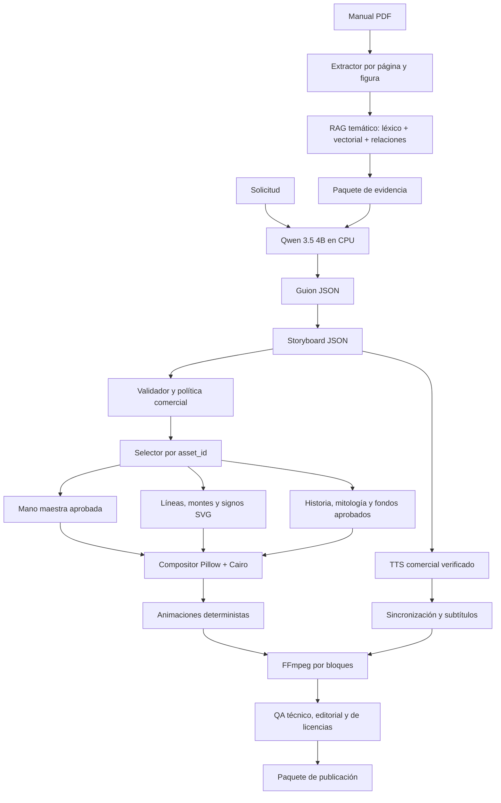

# Arquitectura V7

## Ejecución en GTX 1050 4 GB
- Ollama en CPU como baseline estable.
- GPU para un solo consumidor pesado a la vez.
- ComfyUI opcional, aislado, SD 1.5, 512 px, batch 1.
- Nada de SDXL o FLUX como dependencia base.
- VoiceStudio solo con modelo comercial verificado.
- Composición, SVG, MediaPipe y FFmpeg pueden operar en CPU.

## Modos
- `legacy_v6`: reproducción y regresión.
- `v7_deterministic`: mano + SVG + assets aprobados.
- `v7_hybrid`: V7 determinista con generación opcional de fondos.
- `offline_production`: prohíbe red y assets no aprobados.
