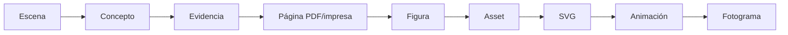
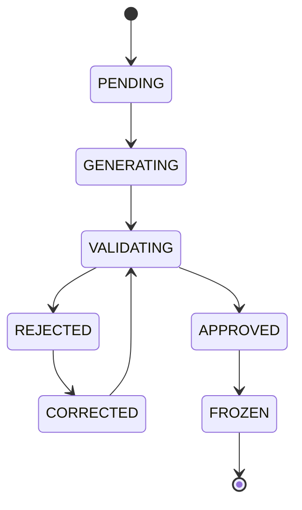
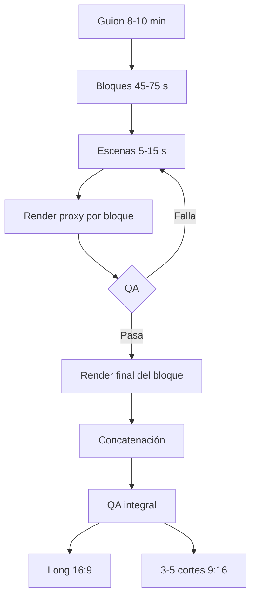
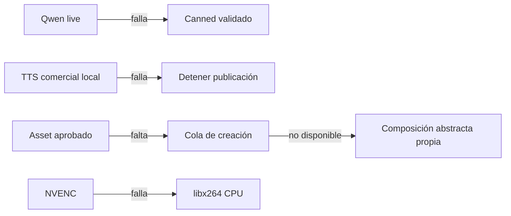

# Diagramas operativos

## Trazabilidad

```mermaid
flowchart LR
 S[Escena] --> C[Concepto] --> E[Evidencia] --> P[Página PDF/impresa] --> F[Figura] --> A[Asset] --> V[SVG] --> N[Animación] --> R[Fotograma]
```

## Estado de asset

```mermaid
stateDiagram-v2
 [*] --> PENDING
 PENDING --> GENERATING
 GENERATING --> VALIDATING
 VALIDATING --> APPROVED
 VALIDATING --> REJECTED
 REJECTED --> CORRECTED
 CORRECTED --> VALIDATING
 APPROVED --> FROZEN
 FROZEN --> [*]
```

## Render largo reanudable

```mermaid
flowchart TD
 A[Guion 8-10 min] --> B[Bloques 45-75 s]
 B --> C[Escenas 5-15 s]
 C --> D[Render proxy por bloque]
 D --> E{QA}
 E -- Falla --> C
 E -- Pasa --> F[Render final del bloque]
 F --> G[Concatenación]
 G --> H[QA integral]
 H --> I[Long 16:9]
 H --> J[3-5 cortes 9:16]
```

## Fallback

```mermaid
flowchart LR
 A[Qwen live] -->|falla| B[Canned validado]
 C[TTS comercial local] -->|falla| D[Detener publicación]
 E[Asset aprobado] -->|falta| F[Cola de creación]
 F -->|no disponible| G[Composición abstracta propia]
 H[NVENC] -->|falla| I[libx264 CPU]
```
